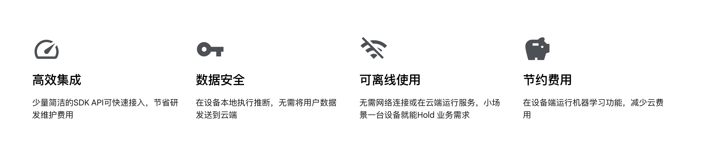
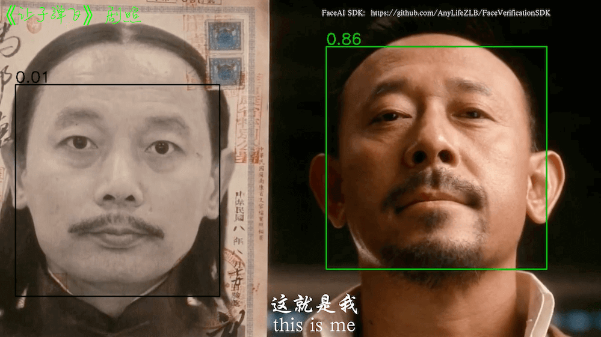

 

 

# [关于「FaceAI SDK」](https://github.com/FaceAISDK/FaceAISDK_Android)

FaceAI SDK is on_device Offline Face Detection 、Recognition 、Liveness Detection Anti Spoofing and 1:N/M:N Face Search SDK

FaceAI SDK是设备端可离线不联网 人脸识别、动作及近红外活体检测、人脸图质量检测和 [1：N以及M：N](https://github.com/FaceAISDK/FaceAISDK_Android/blob/main/Introduce_11_1N_MN.md) 人脸搜索SDK，可快速集成实现人脸识别，人脸搜索功能。

## 简要说明

SDK 支持Android[5,15] **所有功能都在设备终端离线执行，SDK本身不用联网，不保存不上传任何人脸信息敏感资料更具隐私安全**

动作活体支持张嘴、微笑、眨眼、摇头、点头 随机两种组合验证（支持去除特定的动作），20250711版本支持多种UVC红外双目摄像头，需配备宽动态值大于105Db成像清晰抗逆光摄像头。

集成到主项目有问题请描述SDK版本，运行环境和使用场景描述到GitHub提issues或发邮件到 FaceAISDK.Service@gmail.com ，VIP用户可添加 微信：FaceAISDK

**其他平台**  

**iOS SDK：** https://github.com/FaceAISDK/FaceAISDK_iOS  
**Uni App：** https://github.com/FaceAISDK/FaceAISDK_uniapp_UTS  
**Android：** https://github.com/FaceAISDK/FaceAISDK_Android  

**其他实现**  
**React native** https://github.com/zkteco-home/react-native-face-recognition  
**Flutter** need your help

## 当前版本说明 V2.0.0.release  (建议升级到20250712以上重构版本)
- 暴露并优化相机管理CameraX,防止低配RK3588长时间运行白屏
- 符合设定阈值的所有人脸搜索结果返回
- 优化人脸搜索和开放三方UVC摄像头管理
- 优化低配设备人脸录入和识别活体校验优化
- 优化低配设备设备速度，解决某些情况闪退问题

建议[Fork] + [Star] 本项目Repo以便第一手获取更新：[FaceAISDK_Android](https://github.com/FaceAISDK/FaceAISDK_Android)

## [使用场景和区别](https://github.com/FaceAISDK/FaceAISDK_Android/blob/main/doc/Introduce_11_1N_MN.md)

【1:1】 移动考勤签到、App免密登录、刷脸授权、刷脸解锁、巡更打卡真人校验

【1:N】 小区门禁、公司门禁、智能门锁、智慧校园、景区、工地、社区、酒店等

【M:N】 公安布控、人群追踪 监控等 (测试效果可使用images/MN_face_search_test.jpg 模拟)

## 接入集成使用
   
先在[「GitHub网站」](https://github.com/FaceAISDK/FaceAISDK_Android)下载最新接入SDK 接入代码导入到Android Studio。  
Demo聚焦演示SDK的核心功能，部分细节并不完善，需要你根据你的业务需求自行完善。

*   1.调整JDK版本到java 17。AS设置Preferences -> Build -> Gradle -> JDK的版本为 17

*   2.最好翻墙科学上网同步AGP Gradle 插件7.4.2(或者更新AGP),然后同步其他依赖

*   3.Demo工程成功运行后，根据你的业务需求重点熟悉对应模块后再集成到你的主工程

*   4.**集成到你的主工程**，首先Gradle 中引入依赖
    implementation 'io.github.FaceAISDK:Android:版本号' //及时升级到github最新版

*   5.解决项目工程中的第三方依赖库和主工程的冲突比如CameraX的版本等，Target SDK不同导致的冲突

    目前SDK开发使用**java17. kotlin 1.9.22，AGP 7.x **打包，如果你的项目较老还在使用
    kapt, kotlin-android-extensions导致集成冲突，建议尽快升级项目或者VIP联系定制

    更多使用说明下载SDK源码工程代码到Android Studio 以及下载Demo APK到手机体验完整的流程和效果
    里面有详尽的注释说明和使用方法介绍，SDK集成Demo源码熟悉完后再集成到你的主工程

**工程目录结构简要介绍**

| 模块           | 描述                                           |
|---------------|----------------------------------------------|
| Demo          | Demo主工程，implementation project(':faceAILib') |
| faceAILib     | 子Module，FaceAISDK 所有功能都在module 中演示           |
| /verify/\*    | 1:1 人脸检测识别，活体检测页面，静态人脸对比                     |
| /search/\*    | 1:N 人脸搜索识别，人脸库增删改管理等财政                       |
| /addFaceImage | 人脸识别和搜索共用的添加人脸照片录入模块                         |
| /UVCCamera/\* | UVC协议双目红外摄像头人脸识别，人脸搜索，一般是自自定义的硬件             |
| /SysCamera/\* | 手机，平板自带的系统相机，一般系统摄像头打开就能看效果                  |

## Demo APK 下载体验

更多历史版本查看这里： https://www.pgyer.com/faceVerify

## 如何提升接入效率，提高SDK识别准确率

### 提升接入效率

1.  去蒲公英下载APK Demo体验各种功能，查验是否满足业务需求；人脸搜索可以一键导入自带300张人脸图然后再录入你自己的
2.  更新GitHub 最新的代码，花1天左右时间熟悉SDK API 和对应的注释备注，断点调试一下基本功能；熟悉后再接入到主工程
3.  欲速则不达，一定要先跑成功SDK接入指引Demo。熟悉后再接入到主工程验证匹配业务功能；有问题可以GitHub 提issues

### 提高SDK识别率与人脸搜索准确度

1.  使用宽动态（人脸搜索须大于105 Db）抗逆光成像清晰摄像头；**保持镜头干净（纯棉布擦拭油污）**
2.  录入高质量的人脸图，可参考（images/face\_example.jpg）
3.  光线环境好否则加补光灯，人脸无遮挡，没有化浓妆 或 粗框眼镜墨镜、口罩等大面积遮挡
4.  录入的人脸图五官清晰无遮挡，尺寸大于 300*300（人脸部分区域大于200*200） 

 更多说明：https://mp.weixin.qq.com/s/G2dvFQraw-TAzDRFIgdobA

## 常见问题
常见问题请参考：https://github.com/FaceAISDK/FaceAISDK_Android/blob/main/doc/questions.md  
所有的开发测试都在手机和平板进行，特殊定制硬件如 RK3288 可能需要配置适配，UVC 协议摄像头SDK都支持驱动
适配，支持匹配选择RGB/IR摄像头，角度切换等操作。

下载最新SDK Demo 源码熟悉代码后再集成到你的主工程，可以先整个Copy faceAiLib到你主工程先跑起来
再根据业务情况修改完善，有提前熟悉大4小时就能集成成功，丰富产品功能同时可大大降低公司研发投入实现降本增效。  

 .
  
