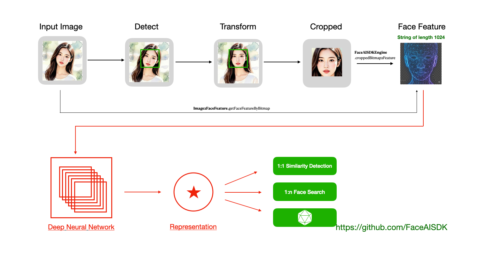

 

  

# [关于「FaceAI SDK」](https://github.com/FaceAISDK/FaceAISDK_Android)

FaceAI SDK is on_device Offline Face Detection 、Recognition 、Liveness Detection Anti Spoofing and 1:N/M:N Face Search SDK。
FaceAI SDK包括人脸识别、活体检测、人脸录入检测以及[1：N以及M：N](https://github.com/FaceAISDK/FaceAISDK_Android/blob/main/Introduce_11_1N_MN.md) 人脸搜索，可快速集成实现端侧人脸识别，人脸搜索等功能。

Android SDK可支持Android[5,16] **SDK激活和使用都不用联网，不保存不上传任何人脸信息敏感资料更具隐私安全**
动作活体支持张嘴、微笑、眨眼、摇头、点头 随机1-2种组合验证，支持系统摄像头和UVC协议USB摄像头，宽动态值大于105Db成像清晰抗逆光。
开发人员也可以自定义摄像头管理，把帧数据送入到SDK。更多说明联系邮箱： FaceAISDK.Service@gmail.com

##  V2025.12.02
- SDK 体积缩减部分,解决11.26版本精度下降问题
- 提升人脸检测和搜索识别精度，人脸特征数据合规处理
- SDK录入人脸优化，合并部分API
- 性能优化并解决人脸框不准确等体验问题
- iOS，Android人脸特征值互通互用（1024 长度）

本次更新前后替换API 对比记录 https://github.com/FaceAISDK/FaceAISDK_Android/commit/ca6fc27aa58c7f33dadc76f1dfb7325701a62dc9

## 接入集成使用
  更新GitHub 最新的代码，花1天左右时间熟悉SDK API 和对应的注释备注，断点调试一下基本功能；熟悉后再接入到主工程   
  欲速则不达，一定要先跑成功SDK接入示范Demo,熟悉后再接入到主工程验证匹配业务功能；有问题可以GitHub 提issues

*   1.调整JDK版本到java 17。AS设置Preferences -> Build -> Gradle -> JDK的版本为 17

*   2.升级Android Studio 到2025.1.4,同时升级AGP到8.13，并同步Demo工程中的其他依赖

*   3.Demo工程成功运行后，根据你的业务需求重点熟悉对应模块后再集成到你的主工程

*   4.**集成到你的主工程**，首先Gradle 中引入依赖
    implementation 'io.github.FaceAISDK:Android:版本号' //及时升级到github最新版

*   5.解决项目工程中的第三方依赖库和主工程的冲突比如CameraX的版本等，Target SDK不同导致的冲突

    目前SDK Demo默认使用**Android Studio2025.1.4 + java17 + kotlin1.9.22 + AGP8.13 打包  
    不建议再使用废弃的kapt, kotlin-android-extensions  
    注：为了Debug View Bitmap以及更好的使用AI 辅助编程开发,2025年10月31号我们对开发环境升级到上述版本 

**工程目录结构简要介绍**

| 模块           | 描述                                           |
|---------------|----------------------------------------------|
| Demo          | Demo主工程，implementation project(':faceAILib') |
| faceAILib     | 子Module，FaceAISDK 所有功能都在module 中演示           |
| /verify/\*    | 1:1 人脸检测识别，活体检测页面，静态人脸对比                     |
| /search/\*    | 1:N 人脸搜索识别，人脸库增删改管理等财政                       |
| /addFaceImage | 人脸识别和搜索共用的通过SDK相机添加人脸获取人脸特征值                 |
| /SysCamera/\* | 手机，平板自带的系统相机，一般系统摄像头打开就能看效果                  |
| /UVCCamera/\* | UVC协议USB摄像头人脸识别，人脸搜索，一般是自自定义的硬件              |

更多历史版本说明参考 [历史版本SDK更新记录](doc/历史版本SDK更新记录.md)

## [使用场景和区别](https://github.com/FaceAISDK/FaceAISDK_Android/blob/main/doc/Introduce_11_1N_MN.md)

【1:1】 移动考勤签到、App免密登录、刷脸授权、刷脸解锁、巡更打卡真人校验

【1:N】 小区门禁、公司门禁、智能门锁、智慧校园、机器人、智能家居、社区、酒店等

【M:N】 公安布控、人群追踪 监控等 (测试效果可使用images/MN_face_search_test.jpg 模拟)

**其他平台**
**iOS SDK：** https://github.com/FaceAISDK/FaceAISDK_iOS  
**Android：** https://github.com/FaceAISDK/FaceAISDK_Android

**其他实现**  
**React native** https://github.com/zkteco-home/react-native-face-ai  
**uni-App X：**  https://github.com/FaceAISDK/FaceAISDK_uniapp_UTS  
**uni-App ：**   https://github.com/FaceAISDK/UniPlugin-FaceAISDK  
**Flutter ：**   need your help

## Demo APK 下载体验  

 **都看到这了，顺手帮忙点个🌟Star吧**
🪐
  

[更多说明，请参考：FaceAISDK产品说明及API文档](FaceAISDK产品说明及API文档.pdf)